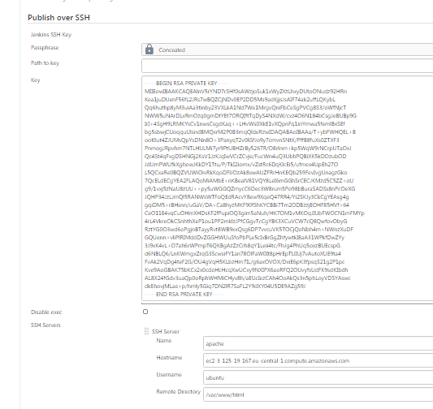
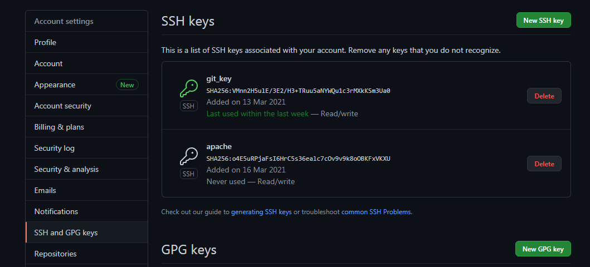
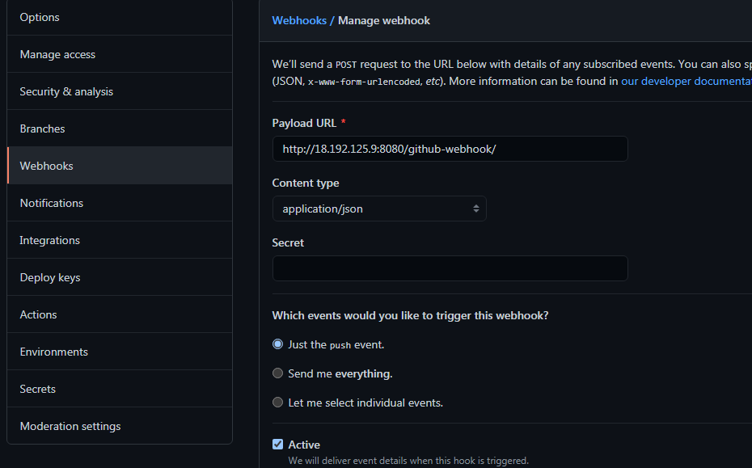
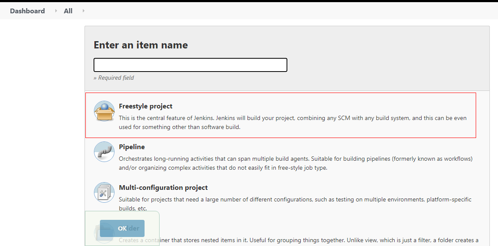
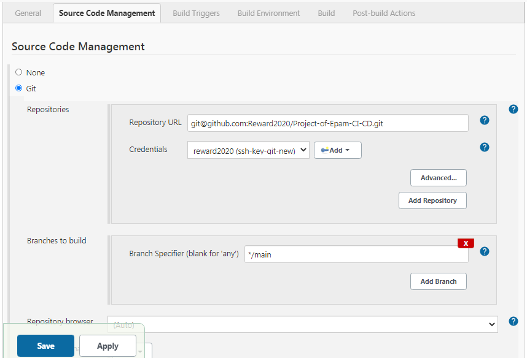
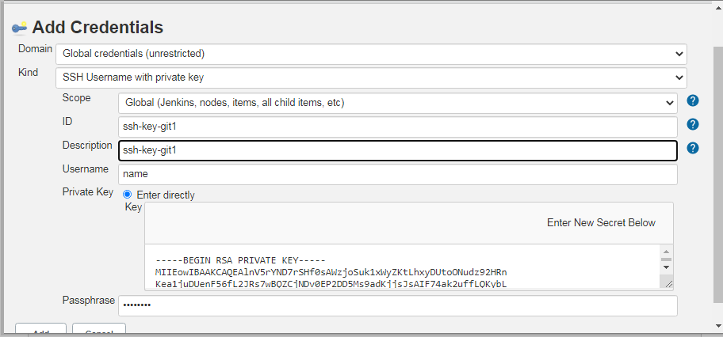
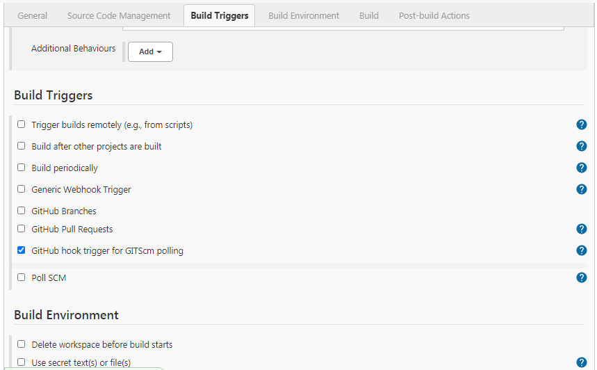
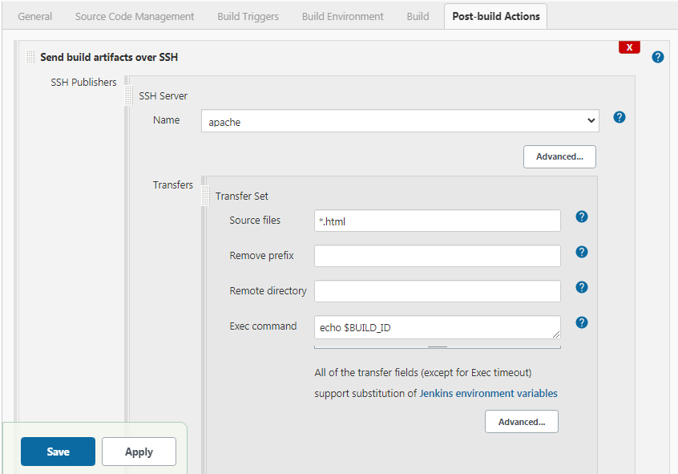

# Project-of-Epam-CI-CD
Project of Epam CI/CD

<h3>Foreword!</h3>
<br>This project gave me some skills and knowledges for my develop. 
<br>I want to thanks Epam company for their courses and 
<br>all curators who teach and known what they do.
<br>
<br>For my project I used next:
<br>

<br> 

<br>
<br>How I did it!
<br>

#### First step we must install terraform on local machine.
#### OS Ubuntu 16.04.
<br>Add the HashiCorp GPG key.
<br>

``` curl -fsSL https://apt.releases.hashicorp.com/gpg | sudo apt-key add - ```

<br>
<br> Add the official HashiCorp Linux repository.
<br>

``` sudo apt-add-repository "deb [arch=amd64] https://apt.releases.hashicorp.com $(lsb_release -cs) main" ```

<br>
<br>Update and install.
<br>

``` sudo apt-get update && sudo apt-get install terraform ```

<br><a href="https://learn.hashicorp.com/tutorials/terraform/install-cli?in=terraform/aws-get-started">For more information you can find on this link</a>

<br>
<br>After install terraform use next code for deploy and install instances on aws. 
<br>At first need to determine the necessary instances which we want to run. Find need ami, instance type. 
<br>Then create key of pair for your instance download key and store.
<br>Name of your key include on code, as shown below

<br> 

```
terraform {
  required_providers {
    aws = {
      source  = "hashicorp/aws"
      version = "~> 3.27"
    }
  }
}

provider "aws" {
  profile = "default"
  region  = "eu-central-1"
}


resource "aws_instance" "apache" {
  ami           = "ami-0d971d62e4d019dcc"
  instance_type = "t2.micro"
  key_name      = "apache"  // Name of your key pair. It should be identical as in aws.
  tags = {
    Name = "ApacheInstance"
  }
}

```

<br>

Before run our code we must initialization terraform. In directory where your *file.tf* use command *terraform init* 

<br>after successfully initialization, chek your settings *terraform plan.* If terraform finish succes you can run *file.tf*

<br>If you have failed like on screan. Fix it. As usually it  is code syntax error.
<br>

<br> 

<br>
A successful check looks something like this
<br>

<br> 

<br>

Apply settings *terraform apply* after successful apply you can show on your run instance.

<br>


<br>  

<br> 

#### Next step we install apache2 & jenkins

<br>For apache2 & jenkins we have different instances.
<br>Connect from ssh and execute next command to install apache2.

 ``` sudo apt install apache2  ```

<br>If on your system enable *ufw* you must open port *80*

<br>Check the status of your firewall.

``` ufw status verbose ```
```
Status: active
Logging: on (low)
Default: deny (incoming), allow (outgoing), disabled (routed)
New profiles: skip

```


``` sudo ufw allow 'Apache' ```

<br> Check change

``` sudo ufw status  ```

```
Output
Status: active

To                         Action      From
--                         ------      ----
OpenSSH                    ALLOW       Anywhere                  
Apache                     ALLOW       Anywhere                  
OpenSSH (v6)               ALLOW       Anywhere (v6)             
Apache (v6)                ALLOW       Anywhere (v6)

```

<br> If ssh port closed you must open port *22*

``` sudo ufw allow ssh ```

<br> Check status apache

``` sudo systemctl status apache2 ```

<br> 


#### Install jenkins

<br>You can find more information on this <a href="https://www.jenkins.io/doc/book/installing/linux/">link</a>

<br>Befor install jenkins check java *sudo apt install openjdk-{version}-jdk*, check version *java -version*
<br> Step to install jenkins

```
1. wget -q -O -https://pkg.jenkins.io/debian-stable/jenkins.io.key | sudo apt-key add -
2. sudo nano /etc/apt/sources.list
3. #Add next string after last row in the editing file
deb https://pkg.jenkins.io/debian-stable binary/
#And save changes
4. sudo apt-get update
5. java -version
6. sudo apt-get install openjdk-8-jdk
7. sudo apt-get install jenkins
8. service jenkinsstatus
9. sudo cat /var/lib/jenkins/secrets/initialAdminPassword
#The output of this command should be entered in input field on the next screan

```

<br> Connect to jenkins, insert *your IP:8080* in browser.

<br> 

<br> insert password, press next
<br> Choose *install suggested plugins* 
<br> Create user with admin privileges
<br> Instance configuration. Write Jenkins URL **example** *http://127.0.0.1:8080/*


#### Configuration connect to servers Jenkins & Apache

<br> First step, open in jenkins *Configuration systems* find *Public over SSH* 
insert your privet key in window *Key* fill in the fields. 

<br>In field *Username* enter the user who will connect to the prod-server

<br>Field *Remote Directory* enter directory destenation

<br> 


#### Second Step

<br>You must copy public key to your prod-server from jenkins server.

<br>You can use command *ssh-copy-id* or copy physically.

<br> After that copy this public key to your github repository.

<br> 

<br> Go to repository settings and select item *webhooks* add new, enter feilds

<br> 

<br> In feild *Payload URL* enter address jenkins server. Content type select *application/json* store change.

<br>Go to the main page Jenkins click new item, give name our project and select freestyle project.

<br> 

<br>Configure Project

<br>In Source Code Managment swich from none to Git

<br> 

<br>Add credentials 

<br> 

<br> Select *Kind* SSH private key, enter feilds *ID* enter name of your private key, enter *Passphrase* if need.
Store and select your created key for git.

<br>In *Build Trigger* select *GitHub hook trigger...*

<br> 
   
<br> Add Post-Buid-Action *Send build artifacts over SSH*

<br> 

<br>Feild *Source file* enter directory or type files what we want download on our prod-server.
Feild exec command we can leave blank.

<br> When we push something to the repository our hook will catch this and send the necessary files to the desired directory.

<br> Thanks for attention!
